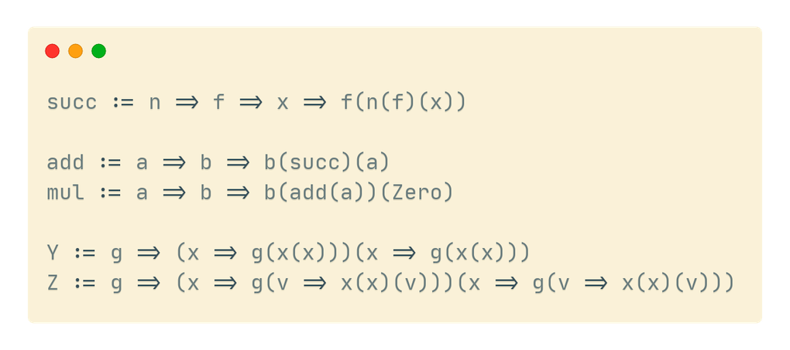

# Lambda calculus in Ink 🖋

This repo implements the [untyped lambda calculus](https://en.wikipedia.org/wiki/Lambda_calculus) with Church numeral encodings and a couple of fixed-point combinators in the [Ink programming language](https://dotink.co/).

`lambda.ink` contains the entire implementation and is thoroughly commented with explanations.



## Try it out

The bottom of the `lambda.ink` file is a short test program that uses the functions and values defined in the file to run a few small test programs, including an implementation of a `factorial`  function working on Church numerals.

The test harness also includes two functions, `toNumber` and `toBool`, that convert the lambda calculus representations of numbers and booleans to their native Ink values.

For example, the Church numeral encoding of the number 3 is `Three`, defined as `f => x => f(f(f(x)))`. To convert a Church numeral to an Ink number value, use `toNumber`.

```
Three := f => x => f(f(f(x)))

toNumber(Three) `` => 3
```

To run the program, run `ink lambda.ink`.
